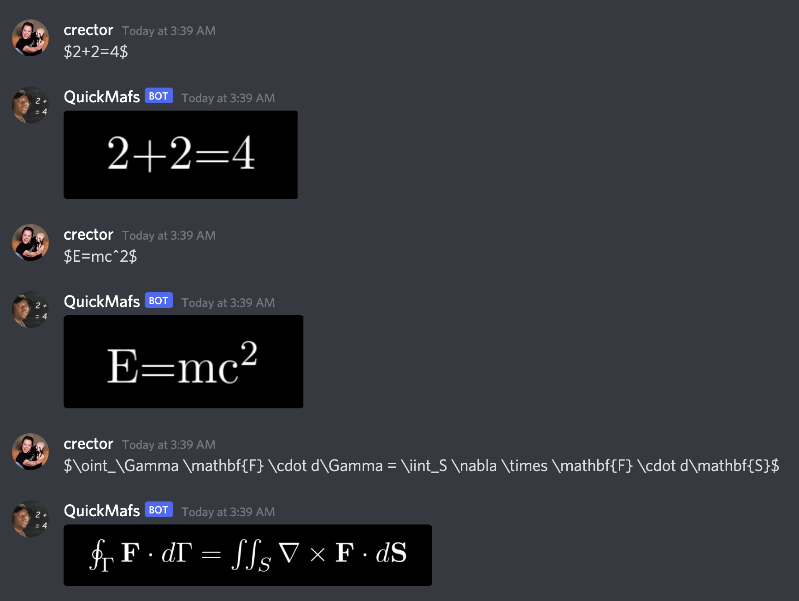

# QuickMafs

This is a Discord bot that parses LaTeX for mathy purposes.

## Setup

Install Node.js. The version doesn't matter. https://nodejs.org/en/

Go to the [Discord developer portal](https://discord.com/developers/applications), create an app, and make it a bot. Locally, create a file named `bot_token.txt` and paste your bot's token into it. Go to the [Permissions Calculator](https://discordapi.com/permissions.html), check any permissions of interest, paste in the Client ID from your OAuth2 page in the developer portal, and then open the Link in a new tab. You can invite the bot to your server from there.

Start the bot with `node .`

